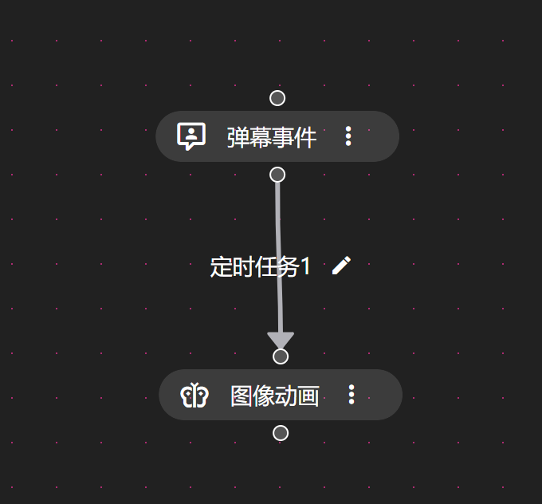
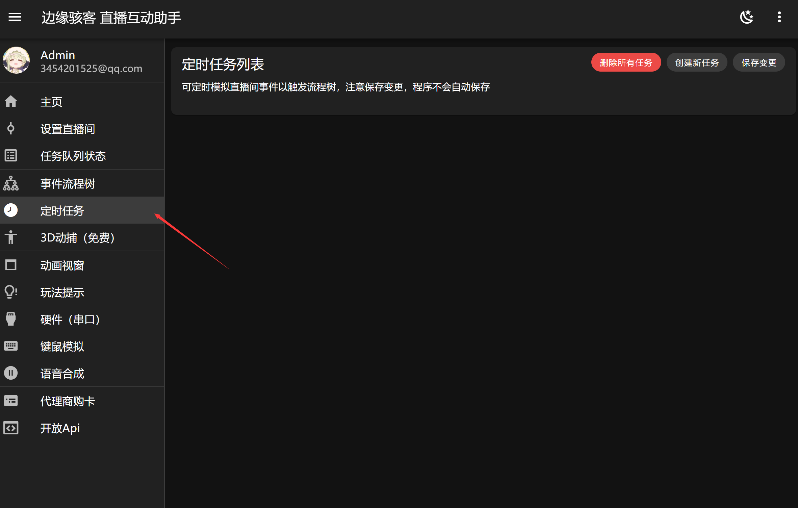
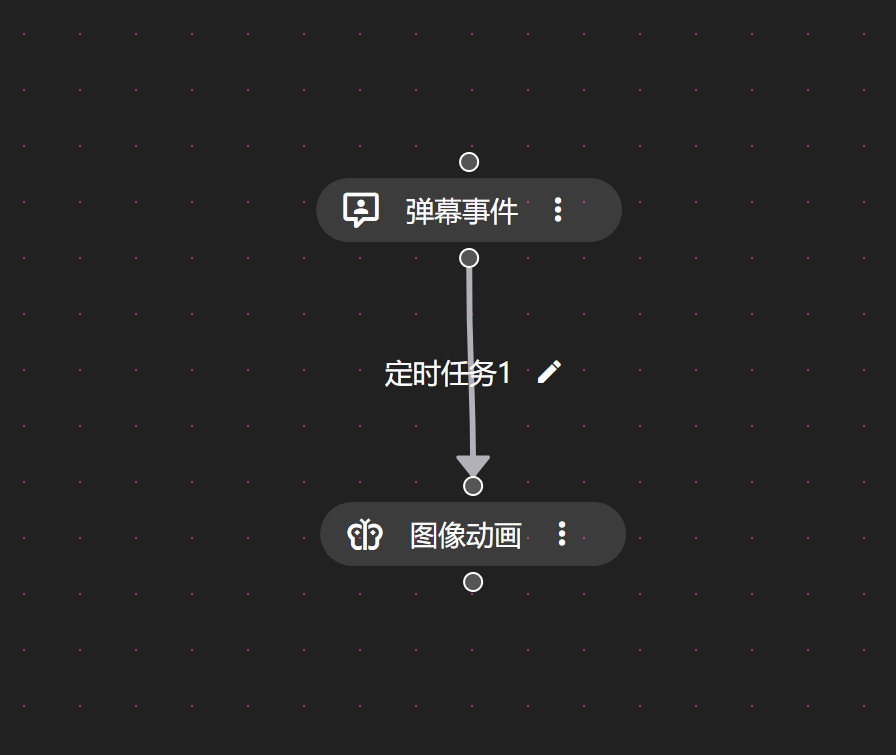

---
slug: simple_1
title: 简单案例分析：案例一（定时任务）
authors: [edgehacker]
tags: [案例分析]
---

简单案例：

定时显示图像

<!-- truncate -->

使用具体场景：17、18 点时，每隔 20 分钟，定时显示一张随机图像。

## 一、创建定时任务

:::info 注意

定时任务本身不会执行任何功能，其只会定时模拟直播间事件，意味着到达指定时间，流程树会收到提前定义的事件。

:::

## 二、设置流程匹配事件
