高级案例：

弹幕发数字播放对应音频文件和图片文件，空闲时循环播放开场白，刷屏自动过滤

<!-- truncate -->

使用具体场景：

当用户在直播间发送 1 ~ 149 时，播放对应编号的 mp3 文件并放映对应编号的图像，如果已经在播放了，就将任务投放到队列，一个一个排队执行。空闲时，则循环播放开场白 mp3 文件。用户发送编号触发回复时可打断开场白，并进入任务流程，所有任务结束后，随机选取一个开场白文件，重新进入开场白循环播放。如果用户刷屏，则给予处罚，不处理其距离上一条发言一分钟内的弹幕。

## 一、序号检测并放映对应音频文件和图像

因为要检测弹幕，所以需要使用弹幕节点，使用正则表达式 `^(?:1[0-4][0-9]|[1-9][0-9]|[1-9])$` 匹配 1 ~ 149 序号。

如图所示：

接下来，我们利用一个工具：文本变量，在文件路径内使用它，使得弹幕和文件对应起来，以此我们无需费力地添加大量分支或功能节点，这里使用的是 `{{c,0}}`，需要一定正则表达式的知识基础。

`{{c,0}}` 表示匹配到的 0 号结果，在 js 当中，其表示匹配的完整文本，意味着，其表示用户发的具体数字，因此我们只需要在文件夹内提前准备好对应 id 的音频文件，这样数字便和音频文件对应上了。

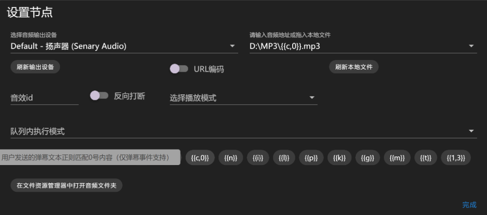

图片节点同理：

## 二、让音频播放和图像显示同时开始
我们知道，弹幕事件一个匹配规则，只能连接一个后继节点，如果要并行，怎么处理呢？所以这里需要使用**并行节点**了。

如图所示：

## 三、让任务一个一个排队播放
设想一下，当正在播放id为1的音频时，有人发送了2，这个时候，为了不影响现有任务，我们需要把新的任务放到队列里排队，让新任务一个接一个的执行，所以，这里就需要使用到**任务队列**了。

:::tip 特别说明

1. 任务队列仅在并行节点下可用，我们这里正好符合条件。
2. 只有动画类节点支持投入任务队列，当前场景正好使用了图像动画。（注：若不想放映图像又想用队列，图像路径打一个空格即可）
3. 非动画节点会被自动附加到第一个设置了队列的动画节点，与之一同投入队列工作。

:::

我们只需要给图像动画节点**指定一个任务队列**，并设置播放模式为**展示至所有附加任务执行完成**即可，如图所示：

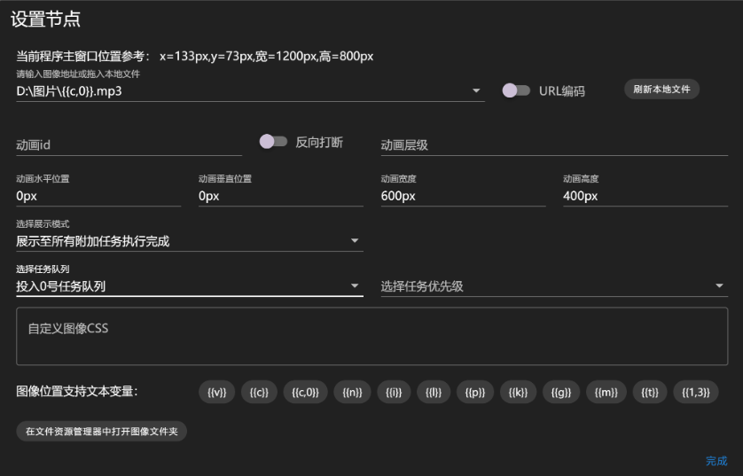

## 四、非序号范围文本随机选取一个开场白 mp3 并循环播放
为了避免直播间冷场，开场白是很必要的，因此我们使用正则表达式 `^(?!(?:1[0-4][0-9]|[1-9][0-9]|[1-9])$).*$` 匹配不是序号的其他任意文本，将其连接到音频播放节点。利用 `{{1,4}}` 文本变量，随机选取音频，并设置播放模式为 循环播放。

但是这样有一个问题，如果有人频繁发送无关文本，会多次触发该支流程，导致多个开场白重叠播放，因此我们需要定义一个音频 id，使得播放任务相互打断。（即：同一个 id 的音频节点无法同时播放不同音频）

与此同时，为了防止默认行为：当前的循环被新任务打断，我们需要开启反向打断，开启后，新任务不再打断现行任务，而是反过来，现行任务会打断新任务，阻止新任务执行。

如图所示：

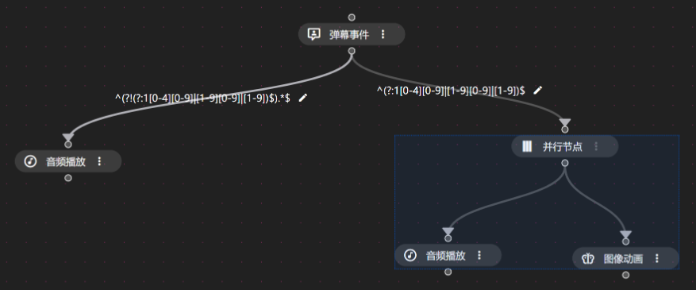
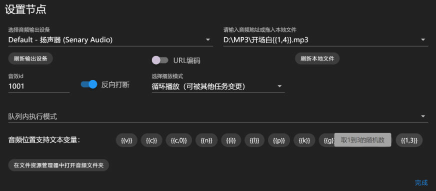

## 五、有工作任务时打断开场白
开场白一直在循环播放，当用户发送数字时，我们需要播放数字对应的音频，这个时候需要打断开场白，因此可以在并行任务当中，增加**移除音频**节点，并指定 id 为循环播放音频节点的音频 id（本文中定义的是 1001）。

如图所示：

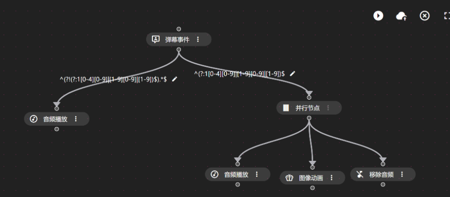
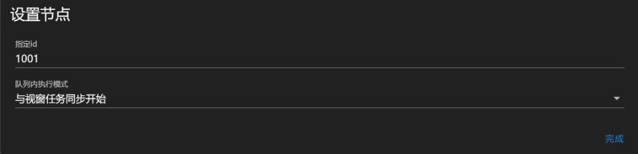

## 六、空闲时恢复开场白
由于我们在每个任务开始时，都强行打断了开场白，因此，我们需要在没有任何任务时（空闲时）恢复开场白，所以可以在并行任务结束的时候，检查任务队列内正在执行的任务数，若为 0，表示刚执行完成的，是最后一个任务，就需要恢复开场白，本文示范的队列是 0 号队列。

配置如图：

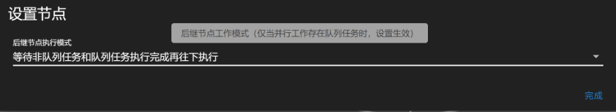

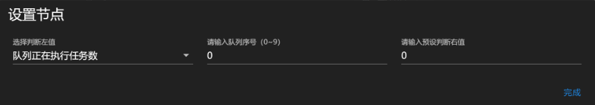

## 七、刷屏过滤
实际使用过程当中，用户可能频繁刷屏，需要设置一定的忽略处罚机制，本文演示的是：用户在一分钟内只能发送一条消息，多余消息都将被忽略，且若用户在这一分钟内不断刷屏，那处罚结束时间也会被自动延后，直到用户安静一分钟后，才会接受他的弹幕。

判断逻辑：

匹配到数字时，将用户值减当前十三位时间戳（初始值为 0 数值或空文本），文本变量 `{{m}}` 表示当前十三位时间戳。

判断用户值是否小于或等于 `-60000`（单位 ms，表示一分钟），如果小于或等于，说明之前没有记录，或者上一条发言在一分钟之前，这个情况就是可以进任务的，但是进任务之前还要更新一下用户值，改成本次发言时间戳。
   
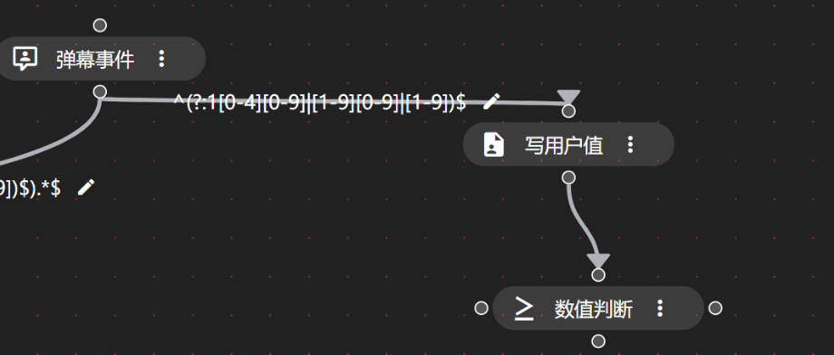
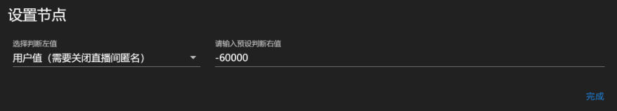

如果用户值减当前十三位时间戳后，大于 `-60000`，说明他在一分钟内重复发过数字，则不进入流程，但需要更新其发言时间为当前十三位时间戳。

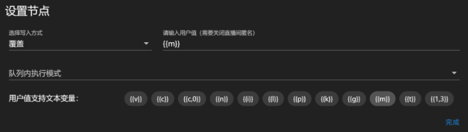

通过上述逻辑，就实现了刷屏过滤和重复刷屏过滤延期处罚。