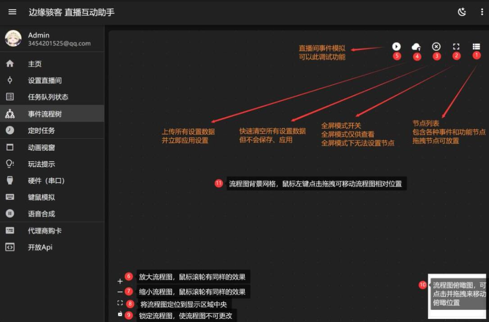
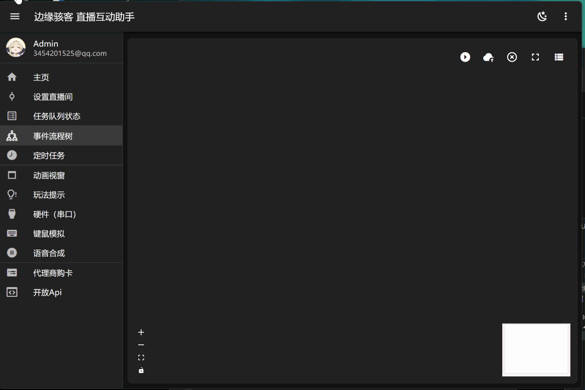
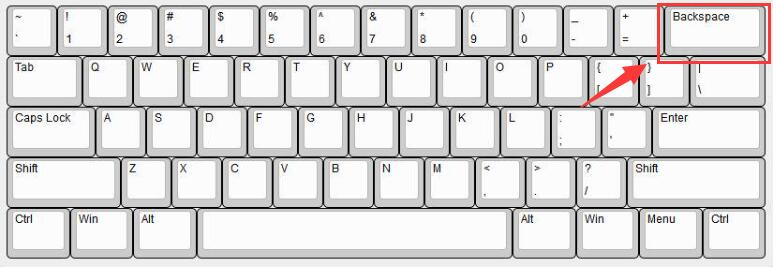
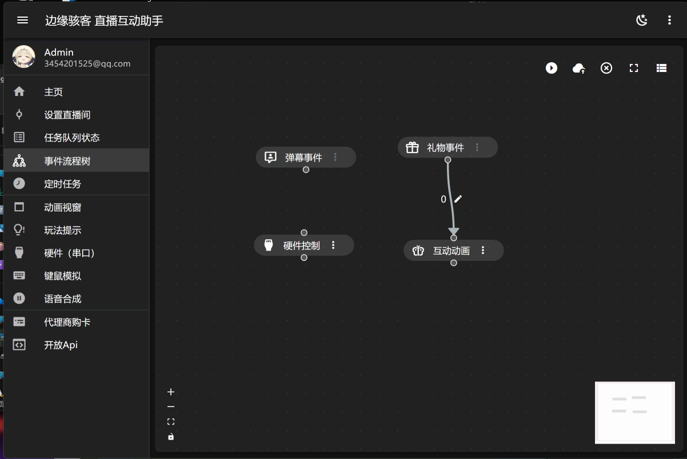

# 事件流程树

事件流程树可自定义各种直播间事件后续触发的操作，完全可视化。（在当前页面文档左侧 `事件流程树节点` 子栏中，会详细介绍各个节点的使用说明）

## 操作界面说明

:::warning 注意

配置完成事件流程树后需要进行上传所有设置数据并立即应用设置，否则将不会保存流程树的配置数据。

:::

## 放置节点 / 设置节点 / 连接节点

在右侧节点菜单栏选择需要使用的节点，鼠标左击长按即刻进行拖动。在流程图区域，点击所选节点右侧竖的 `···` 按钮即可弹出设置节点菜单。将鼠标移动到节点上下实心点区域，然后将您的鼠标长按即可生成连线，连接到其他需要连接上节点的上下实心点区域。

## 删除节点 / 删除节点间连线

使用鼠标左键单击节点或者节点间连线后，使用 **Backspace** 键即可删除节点或者节点间连线。

:::warning 注意

部分电脑可能键盘键位没有显示 `Backspace` 键，则请您使用 `←` 键。

:::

## 变更连接目标

将鼠标光标置于连线末端，出现移动型光标后，使用鼠标左键拖拽即可。

