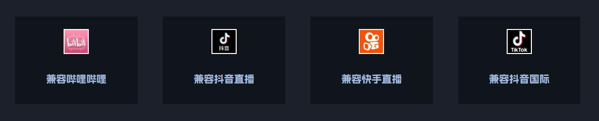
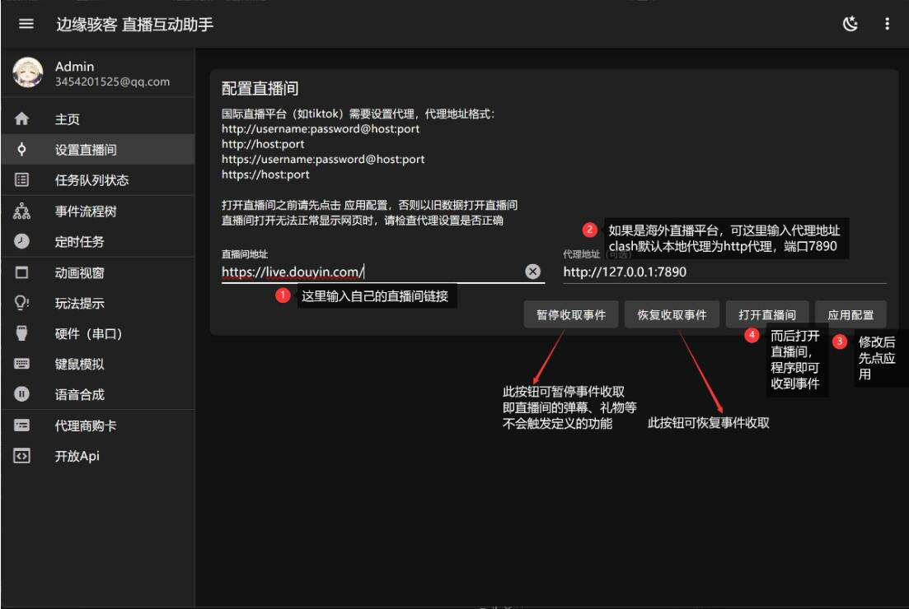

# 配置直播间

边缘骇客直播互动助手当前兼容平台： 抖音视频 · BiliBili · 快手视频 · TikTok

## 直播间地址通配说明

|平台名称|直播间地址通配|是否支持
|-|-|:-:|
|抖音视频|`https://live.douyin.com/直播间ID`|√|
|BiliBili|`http://live.bilibili.com/直播间ID`|√|
|快手视频|`https://live.kuaishou.com/u/直播间ID`|√|
|抖音国际版 TikTok|`https://live.tiktok.com/直播间ID`|√|

## 配置直播间地址

填写自己的直播间链接地址（根据直播间地址通配说明判断地址是否正确），然后点击 `应用配置` 按钮保存配置，接下来点击 `打开直播间` 按钮，程序会弹出子窗口预览直播网页界面，程序就可以接收到直播 event 事件了。

:::warning 注意

如果是海外直播平台，可输入代理地址 clash，默认本地代理为 http 代理，端口是 7890。

:::