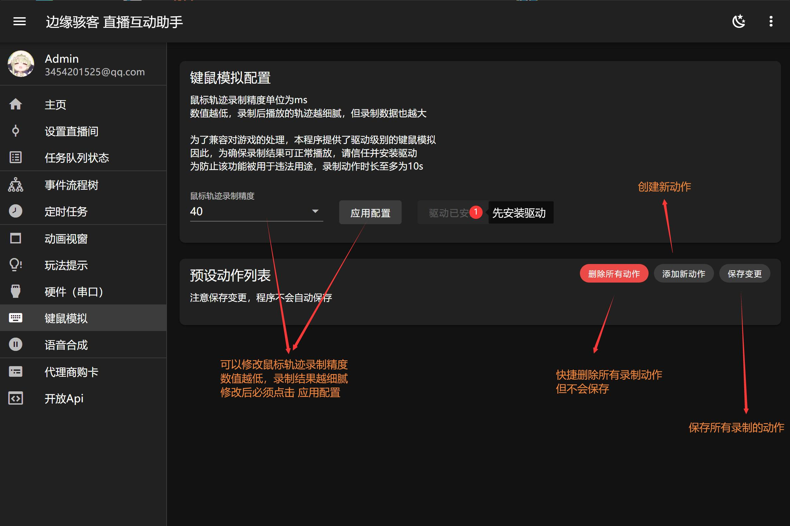
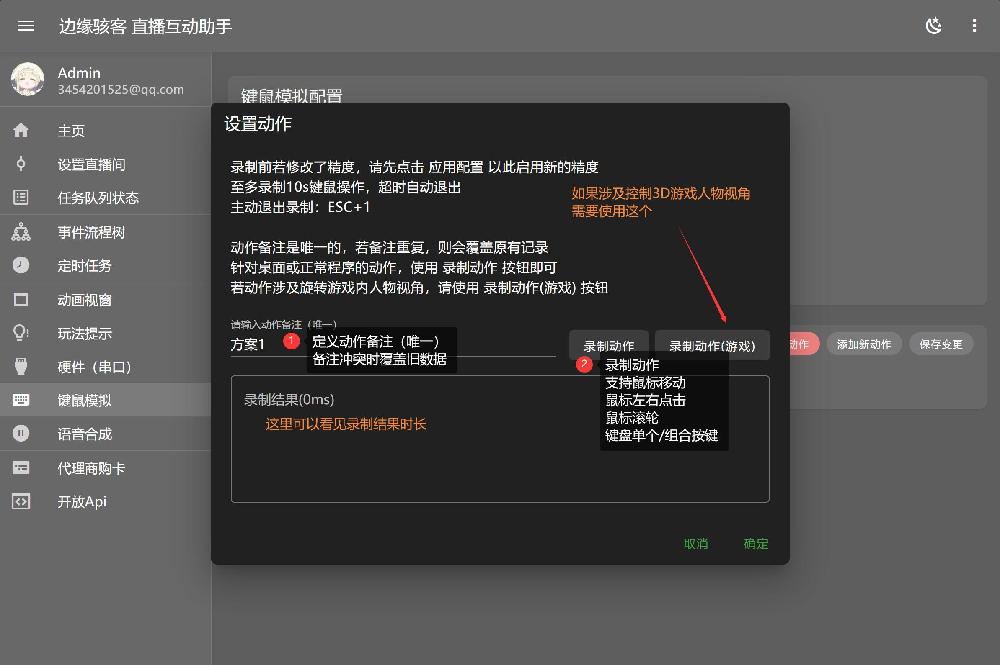

---
title: '键鼠模拟'
sidebar_position: 8
---

# 键鼠模拟

我们提供了驱动级的键鼠模拟，用于实现互动整蛊功能。通过提前录制相应键盘鼠标动作，在事件流程树中触发。

:::info 注意

需要安装驱动才能正常重播动作（目前驱动仅支持 Windows 操作系统）

:::

## 键鼠模拟配置

首先需要安装驱动。可以修改鼠标轨迹录制精度数值越低，录制结果越细腻修改后，必须点击应用配置。点击 `添加新动作` 按钮即刻录制添加新动作。

:::info 注意

在进行 `添加新动作` 或者 `删除动作` 之后，需要点击 `保存变更` 按钮。

:::

## 录制动作

