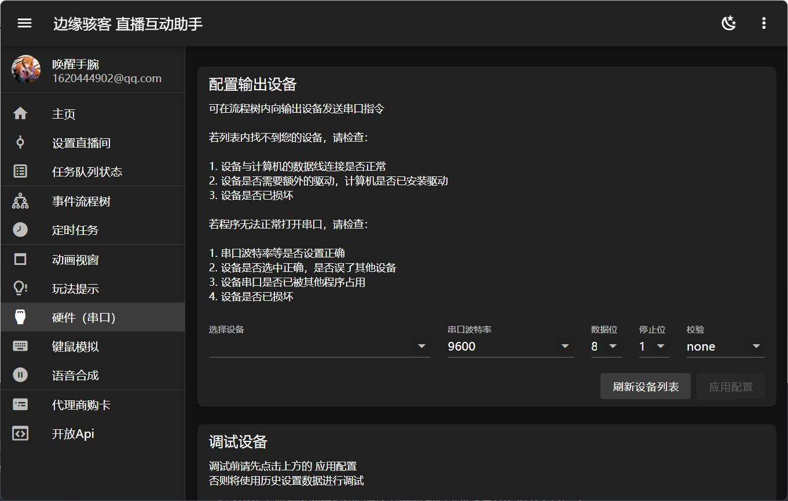

---
title: '硬件（串口）'
sidebar_position: 7
---

# 硬件（串口）

本程序的硬件控制基于串口通信，初始连接参数为主流 STM32 开发板的默认参数。首次使用需选择硬件设备后，点击 **应用配置** 以保存数据并连接硬件，此后程序启动时都将尝试自动连接硬件。

:::info 注意

当前页面涉及硬件专业知识，若您定制了一个直播的硬件设备，但是您不会配置硬件参数，请自行联系您的硬件开发者获取指导。

:::
