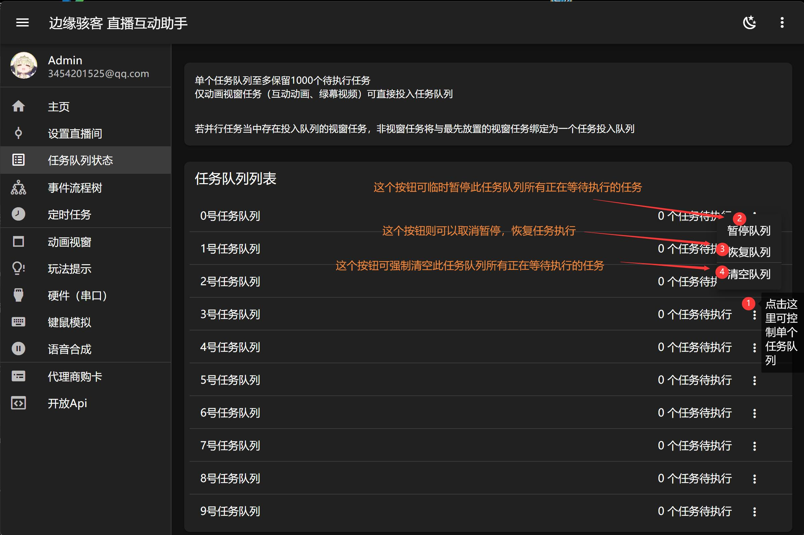

---
title: '任务队列'
sidebar_position: 2
---

# 任务队列说明

所有任务默认都是异步（非同步）执行的，这就意味着任务不会一个一个被执行。若将任务投入队列，可实现任务有序地排队执行，即一个一个轮流的执行。程序提供了 10 个任务队列，单个队列等待任务数上限为 1000 个。

## 任务队列控制

单个任务队列至多保留 1000 个待执行任务。仅动画视窗任务（互动动画、绿幕视频）可直接投入任务队列
若并行任务当中存在投入队列的视窗任务，非视窗任务将与最先放置的视窗任务绑定为一个任务投入队列。

