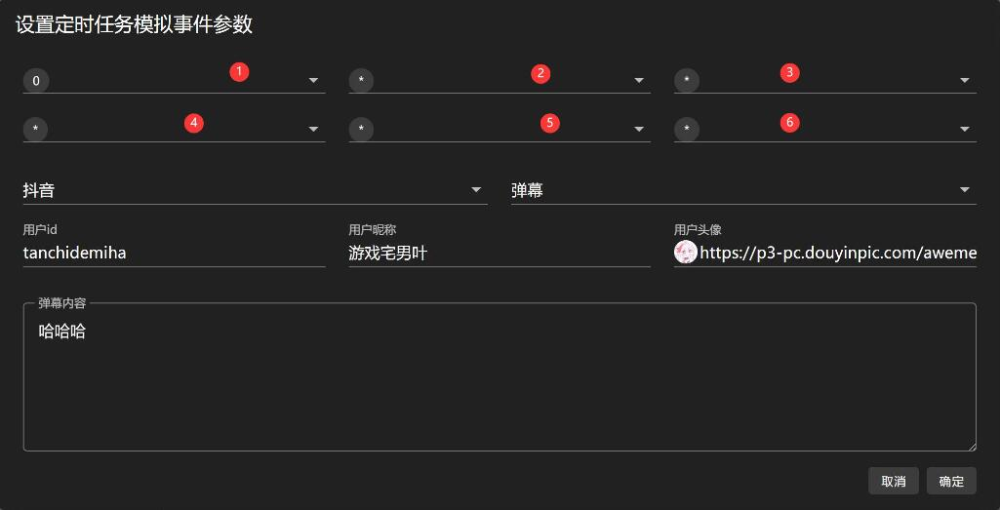
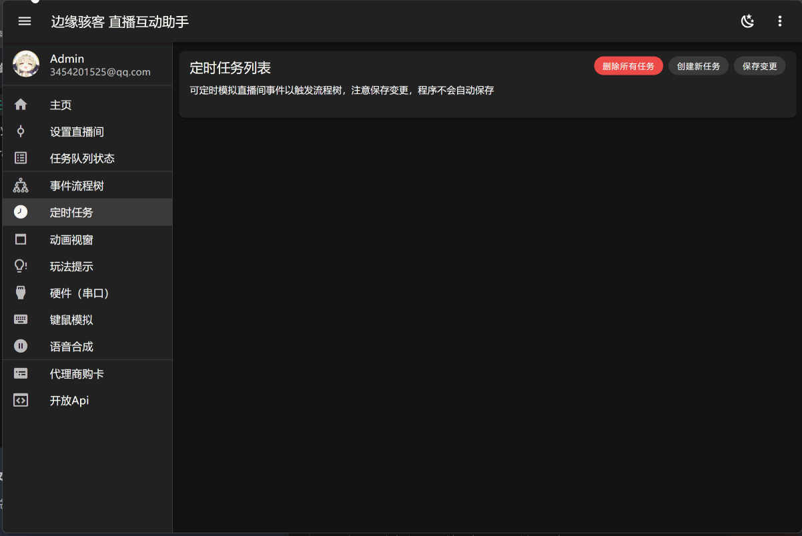

# 定时任务

定时任务可按照设置的定时器规则，定时模拟直播间事件投递给流程树执行。

:::warning 注意

需要点击 `保存变更` 按钮，设置才会保存并应用。

:::

## 定时器规则设置

在您进行设置定时任务模拟事件参数时候，定时器共有 6 个参数来指定工作时间，具体如图所示。

## 配置参数说明

|编号|时间格式|说明|注意|
|-|-|-|-|
|1|秒|控制定时器在哪一秒工作|当参数为 `*` 时表示每一秒都触发工作|
|2|分|控制定时器在哪一分钟工作|当参数为 `*` 时表示每一分钟都触发工作|
|3|时|控制定时器在哪一小时工作|当参数为 `*` 时表示每一小时都触发工作|
|4|日（1 ~ 31 号）|控制定时器在哪一日工作|当参数为 `*` 时表示每一日都触发工作|
|5|月|控制定时器在哪一月份工作|当参数为 `*` 时表示每一月份都触发工作|
|6|周（周日 ~ 周六）|控制定时器在周几工作|当参数为 `*` 时表示一周的每一天都触发工作 0 表示周日|

## 案例示范
>例如：每秒触发一次抖音送礼事件，设置礼物类型 id 编号值为 1。

