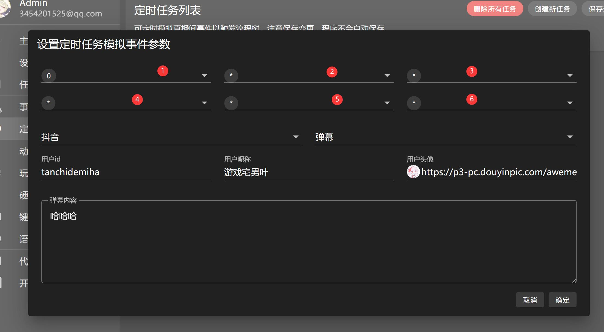
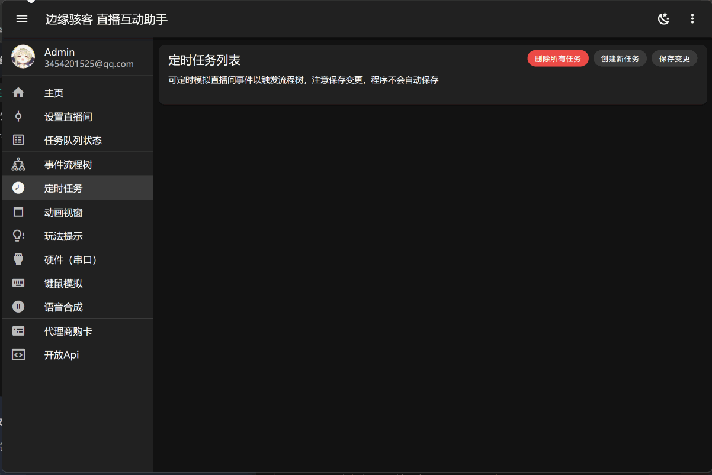

---
title: '定时任务'
sidebar_position: 4
---

# 定时任务

定时任务可按照设置的定时器规则，定时模拟直播间事件投递给流程树执行

:::warning 注意

需要点击 **保存变更** 按钮，设置才会保存并应用

:::

## 定时器规则设置介绍

定时器共6个参数来指定工作时间

- 1: 秒，控制定时器在哪一秒工作，当参数为*时表示每一秒都触发工作
- 2: 分，控制定时器在哪一分钟工作，当参数为*时表示每一分钟都触发工作
- 3: 时，控制定时器在哪一小时工作，当参数为*时表示每一小时都触发工作
- 4: 日(1-31号)，控制定时器在哪一日工作，当参数为*时表示每一日都触发工作
- 5: 月，控制定时器在哪一月份工作，当参数为*时表示每一月份都触发工作
- 6: 周(周日-周六)，控制定时器在周几工作，当参数为*时表示一周的每一天都触发工作，0表示周日

## 示范
### 每秒触发一次抖音送礼事件，礼物id为1

