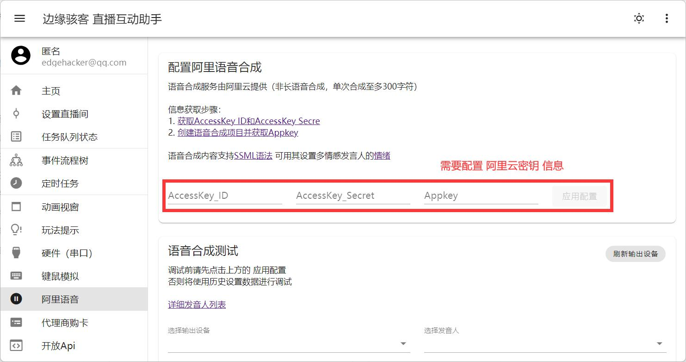

接口描述：执行任务：阿里云语音合成并且进行播放（此处仅提供简单说明，具体效果等请看流程树节点设置）。

## 配置阿里云密钥

## 请求说明
|HTTP Method|HTTP URL|
|:-:|:-:|
|POST|http://localhost:7902/Api/task/o5|

## 请求参数

|属性|类型|必填|说明|
|:-:|:-:|:-:|:-:|
|dev|String|是|音频输出设备id|
|pname|String|是|阿里发音人英文名称|
|vv|Number|是|音量（1 ~ 100）|
|vs|Number|是|语速（-500 ~ 500）|
|vr|Number|是|语调（-500 ~ 500）|
|id|String|是|语音 id|
|pval|String|是|语音合成文本内容|
|pt|String|是|播放模式（0, 1, 2）（播放一次，循环播放，播放指定时长）|
|ps|String|是|指定播放时长（单位: 秒）|

## 返回参数

|属性|类型|说明|
|:-:|:-:|:-:|
|code|Number|错误码（code == 0 表示成功）|
|msg|String|错误发生原因|
