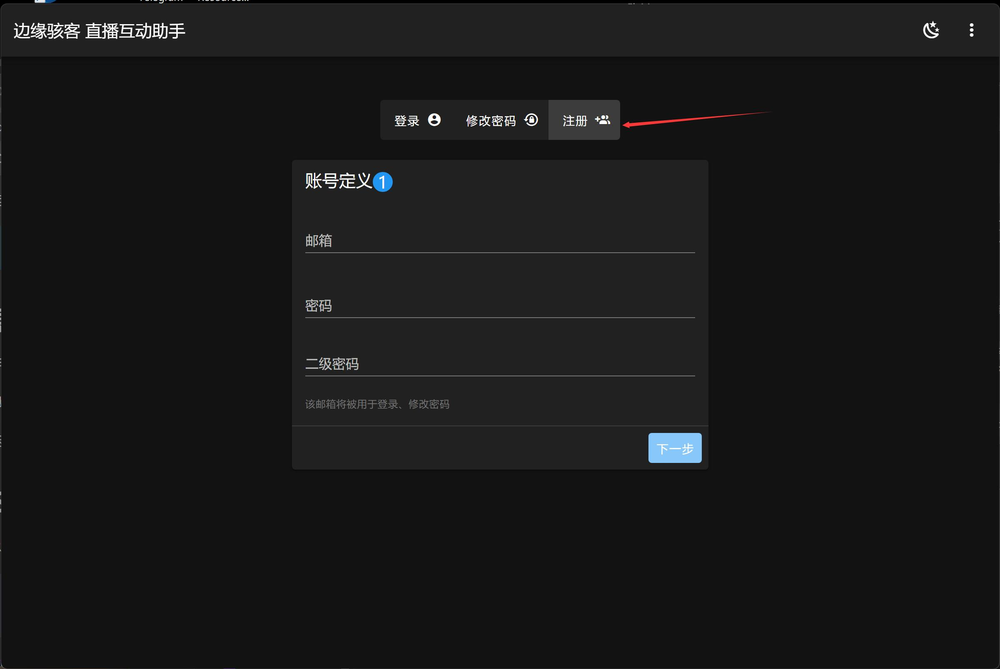
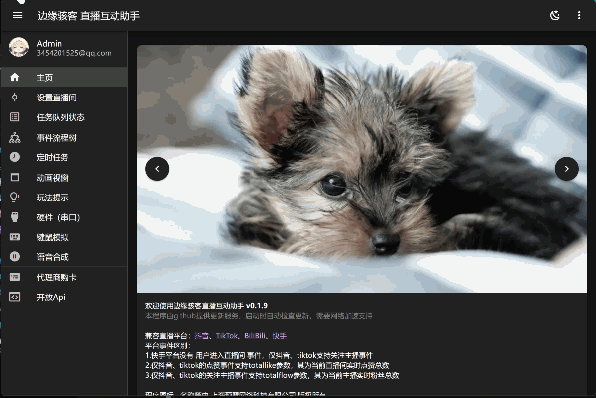
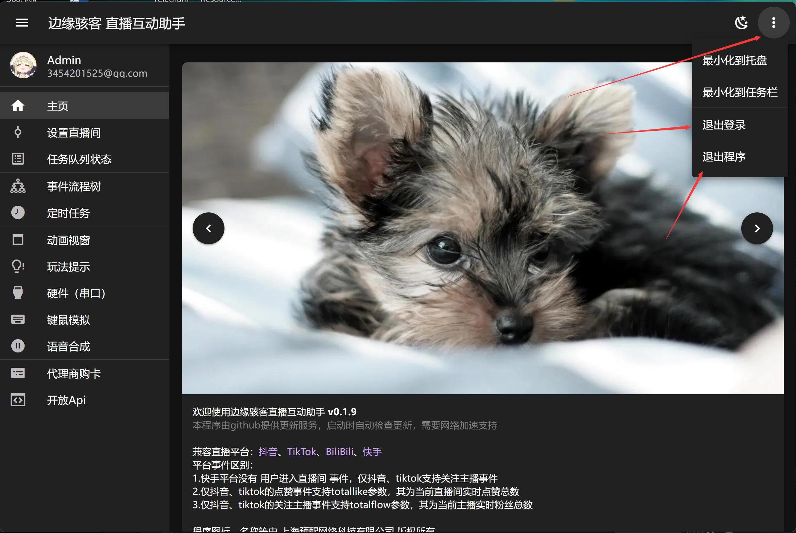

---
sidebar_position: 1
---

# 快速上手

学习安装、更新等基础使用方法

## 安装

您可以通过 **[蓝奏云](https://edgehacker.lanzn.com/b043bgvkb)** 下载最新exe安装

您也可以前往 **[GitHub发布页](https://github.com/edgehacker/live-helper/releases)** 下载exe文件安装，发布页包含更新日志

:::info

GitHub国内访问情况较差，建议使用网络加速器访问

:::

## 更新

手动下载新版本exe后执行安装覆盖，即可完成更新

我们也支持 **自动更新** ，更新服务基于GitHub，更新检查会在程序启动时执行

因此您可以在搭配加速器的情况下重启程序实现自动更新

## 注册

安装程序并启动后，切换至如图页面，即可注册新账号

:::warning

二级密码的权限仅次于邮箱验证码，可改密、注销账号等，不建议与账号密码一致

:::

按照页面引导即可完成注册，若邮箱未收到验证码，请检查邮箱输入是否正确，或检查邮箱的垃圾箱

## 修改信息/续费

点击头像区域即可修改信息、续费

## 退出/切换账号

程序右上角可退出/切换账号
