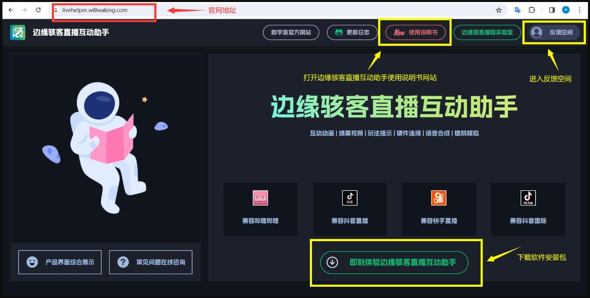
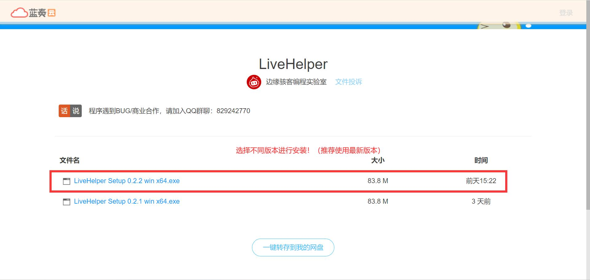
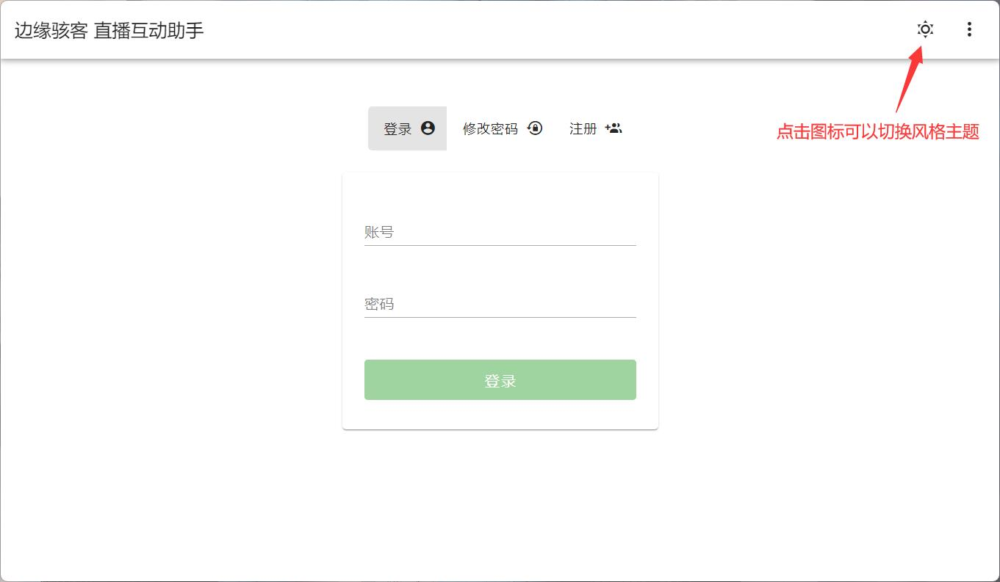
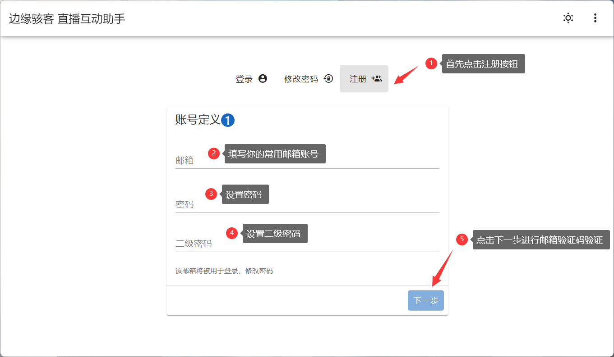
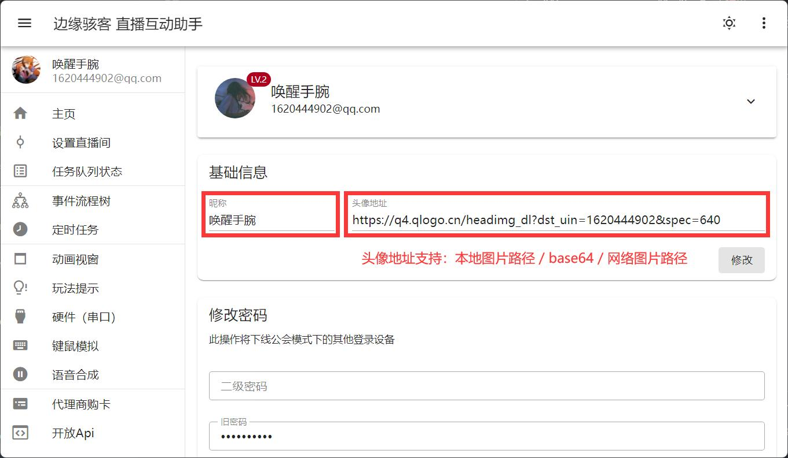
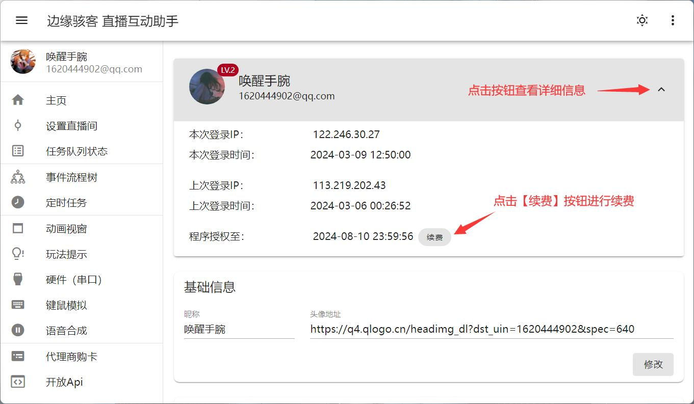
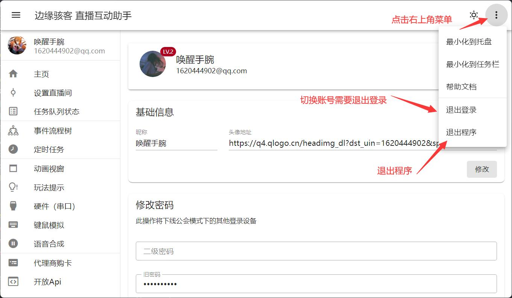

---
sidebar_position: 1
---

# 快速上手

边缘骇客直播互动助手是一款兼容大部分主流平台、模块化设计、可视化编写流程的直播互动助手。我们提供多种渠道方便大家学习直播互动助手程序使用。

`渠道一`：通过边缘骇客直播互动助手帮助文档（非常详细）。

`渠道二`：通过边缘骇客哔哩哔哩 **[边缘骇客直播互动助手视频教程]( https://www.bilibili.com/video/BV1Bq421A7Ju/?share_source=copy_web&vd_source=1dd9ecf437e8c9ba37aa7724857ff23d)** 免费学习视频教程（正在加紧录制中！更新中！）。

<iframe width="100%" height="539px" src="//player.bilibili.com/player.html?aid=1452355896&bvid=BV1Bq421A7Ju&cid=1487551367&p=1" scrolling="no" border="0" frameborder="no" framespacing="0" allowfullscreen="true"> </iframe>

`渠道三`：若您对当前直播互动助手软件使用的学习能力较差，边缘骇客编程实验室工作人员也提供远程指导服务（按照每小时工时收费）和直播模式成品软件应用定制服务（根据您的定制需求收费）。联系地址：**[边缘骇客编程实验室淘宝店](https://edgehacker.taobao.com)**

## 官方网站

边缘骇客直播互动助手官方网站地址：**[https://livehelper.willwaking.com](https://livehelper.willwaking.com)**

:::info
若您对本产品有任何疑问或者对产品功能有反馈，请在[【边缘骇客直播互动助手反馈空间】](https://txc.qq.com/products/511669)提问发帖，我们边缘骇客实验室的工作人员将会在 1 个工作日内给您解答！
:::

## 程序安装包

通过浏览器访问 **[蓝奏云](https://edgehacker.lanzn.com/b043bgvkb)** 选择合适版本 `LiveHelper Setup x.x.x win x64.exe` 下载 exe 安装包（推荐最新版本）

前往 **[GitHub Releases](https://github.com/edgehacker/live-helper/releases)** 选择合适版本进行下载 exe 文件安装（发布页包含更新日志）

:::info
由于 GitHub 源站在国外，在国内访问 GitHub 情况较差，建议使用合适的网络加速器访问下载！
:::

## 程序更新

方案一：通过 **[蓝奏云](https://edgehacker.lanzn.com/b043bgvkb)** 或者 **[GitHub releases](https://github.com/edgehacker/live-helper/releases)** 下载新版本 exe 后执行安装覆盖，即可完成新版本更新。

方案二：边缘骇客直播互动助手支持 **自动更新** 功能，更新服务基于 GitHub 源站，更新检查会在程序启动时执行，因此您可以在搭配加速器的情况下重启程序，从而实现程序自动更新。

## 登陆注册

安装直播互动助手程序并启动后，进入登录界面。（如下所示：可以根据个人喜好选择不同的界面背景主题)

在登录前，若你还没注册过边缘骇客直播互动助手账号，请安装如下操作进行注册账号。

:::warning
二级密码的权限仅次于邮箱验证码，用于进行修改登陆密码、注销账号等，不建议与登陆密码一致。
:::

按照当前页面引导即可完成账号注册，若您的邮箱未能收到验证码，请检查您的邮箱账号输入是否正确，或检查你的邮箱的邮件垃圾箱。

## 编辑基础信息

点击左侧导航栏头像区域进入管理页面，在 `基础信息` 填写昵称和头像地址。

:::info
例如：使用你的 QQ 头像，填写头像地址 `https://q4.qlogo.cn/headimg_dl?dst_uin=你的QQ号&spec=640`
:::

## 续费

## 退出登录 / 切换账号

点击右上角菜单按钮弹出操作菜单。

